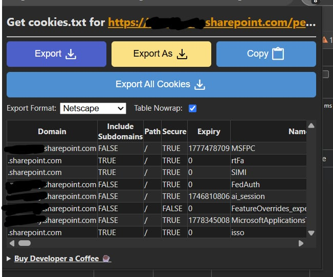
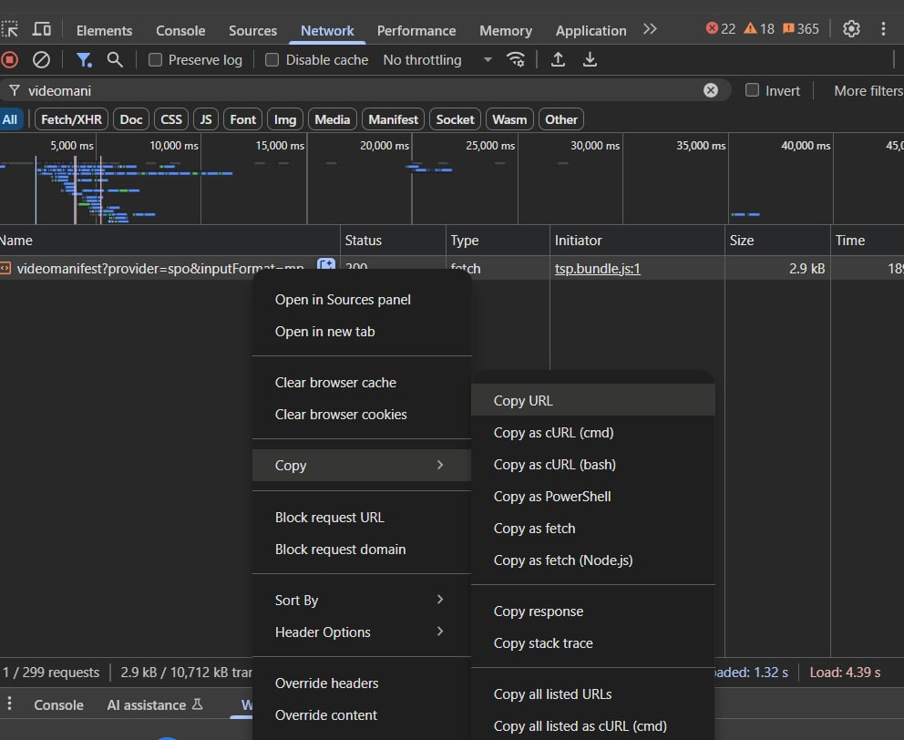

# 📥 Stream/SharePoint Video Downloader

A lightweight, no-install-needed tool for downloading and archiving Microsoft Stream or SharePoint-hosted recordings, including Teams Meetings, using only a `videomanifest` URL and `cookies.txt`.

---

## ✅ Features

- 🎯 No account login or SSO inside the tool — uses your exported browser session cookies
- 🔍 Captures high-quality `.mp4` at up to 720p
- 📁 Works with SharePoint and Microsoft Stream (Classic)
- 🪶 Minimal setup, built on `yt-dlp` and `ffmpeg`

---

## 📌 Valid & Responsible Use Cases

This tool supports legitimate, compliance-aligned workflows for users with authorized access to recorded content. Examples include:

- 🧠 **Transcribing internal meetings**  
  Export recordings for local transcription using tools like [Whisper](https://github.com/openai/whisper) to support documentation or accessibility needs.

- 🔒 **Summarizing with secure AI**  
  Feed local transcripts into privacy-compliant AI models (e.g., Azure OpenAI, Anthropic, or locally hosted LLMs) to generate summaries without exposing sensitive data.

- 🗂 **Building internal knowledge archives**  
  Organize and retain critical recordings (e.g., design sessions, QBRs, trainings) for onboarding, continuity, or governance purposes.

> ✅ Use only with content you’re authorized to access, in accordance with your organization’s IT and data security policies.  
> 🚫 Do **not** upload internal content to public LLMs that may train on submitted data (e.g., ChatGPT, Bard, Claude public endpoints).

## 🧰 Requirements

- [`yt-dlp.exe`](https://github.com/yt-dlp/yt-dlp/releases) in the same folder, or the system PATH (if using local folder, **unblock** the .exe)
- [`ffmpeg.exe`](https://www.gyan.dev/ffmpeg/builds/) in the same folder, or the system PATH (if using local folder, **unblock** the .exe)
- A valid `cookies.txt` file exported from your browser using the Chrome extension outlined below.
- A `videomanifest` URL from the Network tab in browser DevTools

> ⏱️ The ETA timer is a bit unreliable as the speed fluctuates, it downloads first a copy of the video, then a copy of the audio, and then combines them with ffmpeg. Pay attention to the frags downloaded more than anything for estimating time, and just realize that it may take 5-15 minutes to download -- even on a stable, fast connection.

---

## 🪟 Screenshots

### 1. Export `cookies.txt`

Install the [Get cookies.txt (LOCAL)](https://chromewebstore.google.com/detail/get-cookiestxt-local/kfmcaklfhedfpjmlnicdmcdjifkhneid) Chrome extension  
- Set format to `Netscape`
- Click **Export As**
- Save as `cookies.txt`

---

### 2. Copy `videomanifest` URL

- Open DevTools → Network tab
- Filter for `videomanifest`
- Right-click the request and choose **Copy URL**

---

## 🚀 How to Use

1. Run `ms-stream-downloader.py` 
2. Paste the copied `videomanifest` URL
3. Select your `cookies.txt` file
4. Choose a destination `.mp4` file
5. The app will download and convert the video using `yt-dlp`

---

## 📂 Example Folder Structure

<pre> 📁 StreamDownloader   ├── ms-stream-downloader.py   ├── yt-dlp.exe   ├── ffmpeg.exe   └── cookies.txt </pre>
